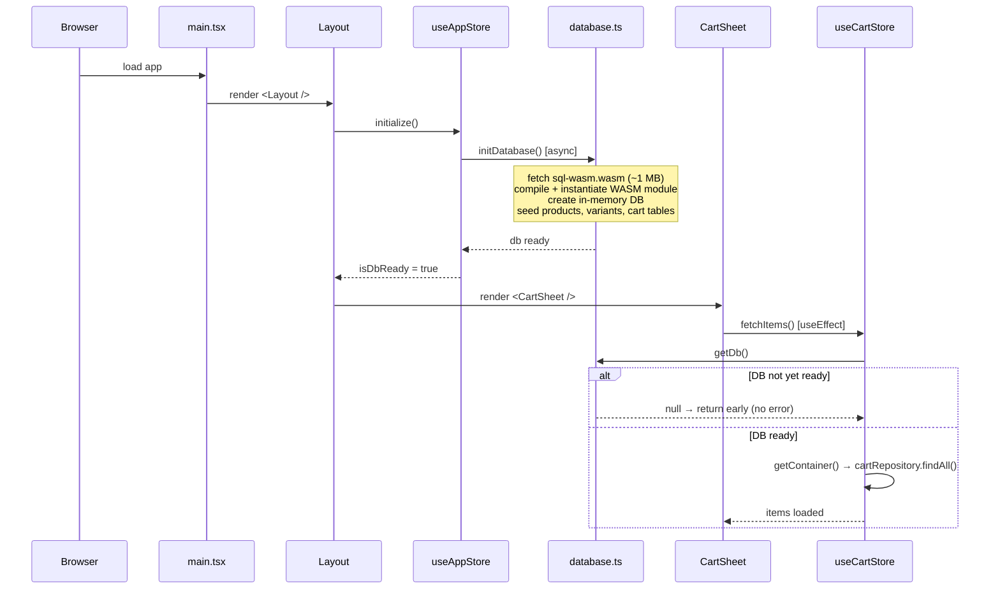
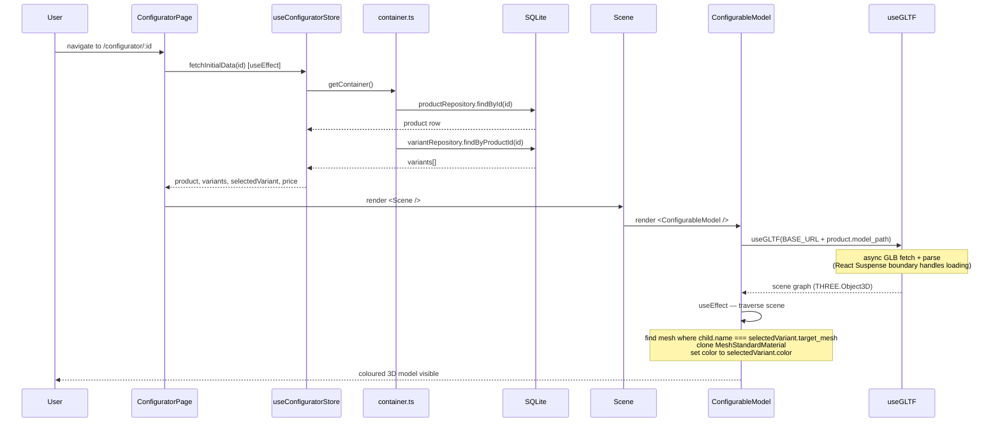
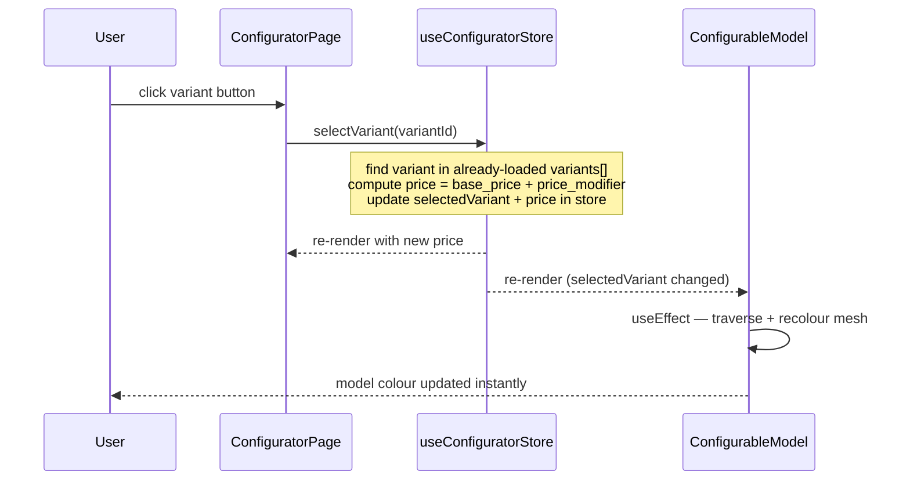
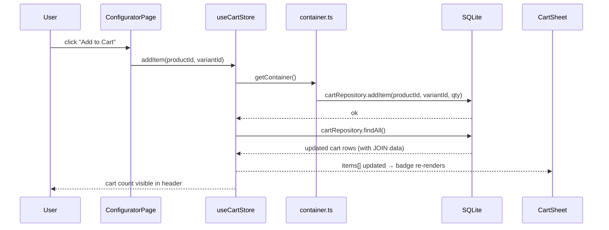

# Architecture — Runtime View

> arc42 § 6 · focuses on the dynamic behaviour of the system at runtime.
> Static structure (modules, layers, dependencies) is described in the README.

---

## 1. Application Startup

The first significant runtime challenge is the **asynchronous initialization** of the SQLite-WASM engine. The browser must fetch and compile the WASM binary before any data layer call is valid.

**Key design decision:** `useCartStore.fetchItems()` guards on `getDb() !== null` to silently absorb the race between React's initial render and WASM initialization. No retry logic is needed because subsequent user-triggered operations always run after the DB is ready.

---

## 2. Product Configurator Flow

When the user navigates to `/configurator/:id`, two independent async chains start in parallel: one fetches product data from SQLite, the other streams the GLB model from the network.

---

## 3. Variant Selection

After the initial load, changing a variant is a **synchronous, zero-latency** operation — no network or DB call is needed.

---

## 4. Add to Cart

